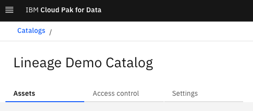
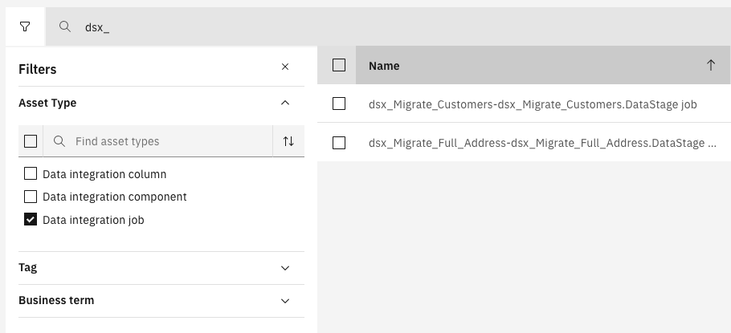
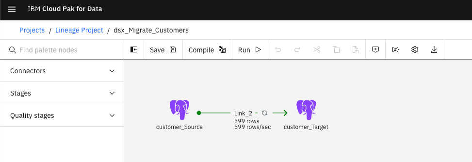
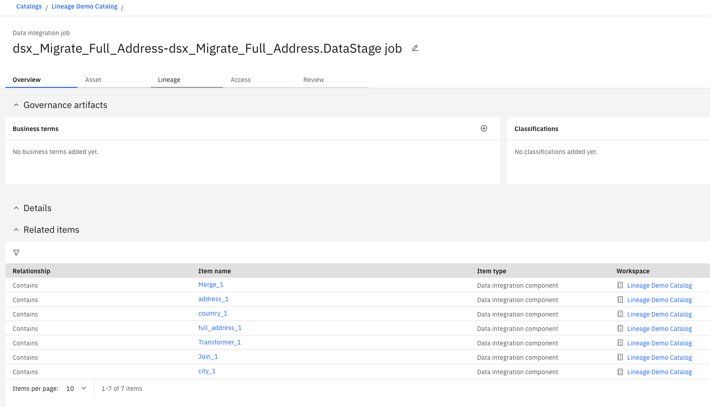
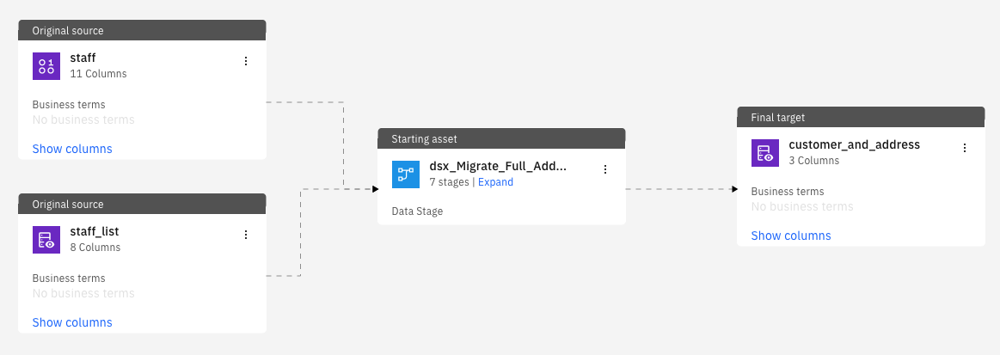
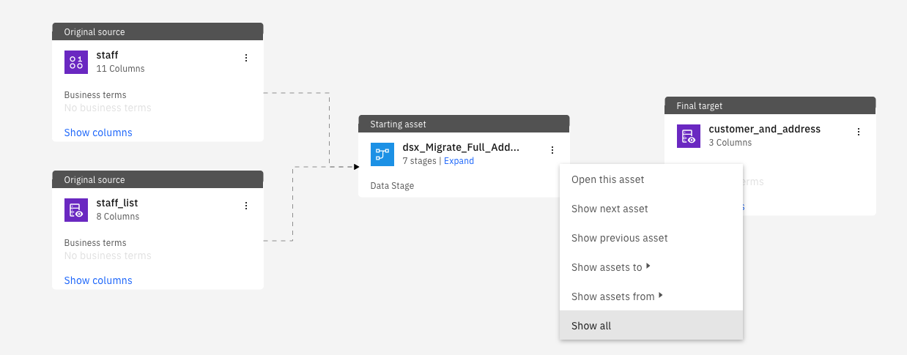
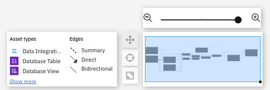

# Objectives

This chapter of the lab exercise will provide the sample flow, how you may discover your metadata lineage results and demonstrate that to business and technical teams.

> [!IMPORTANT]
> The lineage results are only available if you cover all the previous steps of the lab, including the last one [Step 2 - Lineage metadata import](/Data%20Lineage/Lab1_data_lineage_ETL_Postgres_2_Lineage_metadata_import.md).

# 6. Review of lineage analysis

So far the whole goal of the excercise was to create the set of metadata definitions to imitate couple of corporate applications with repository and the data pipelines moving data between those.

We have created:

- Source database PostgreSQL dvdrental
- Target database PostgreSQL public
- DataStage ETL job dsx_Migrate_Customers
- DataStage ETL job dsx_Migrate_Full_Address

Next we have used the IKC metadata import processes to retrieve the metadata from those and publish that to the catalog "Lineage Demo Catalog"

The import has been enabled by Manta technology natively integrated into IBM Cloud Pak for Data v4.8.1 as the containerised service deployed next to IBM Knowledge Catalog. Due to this we can have several levels of representations of imported metadata. One is the high level business lineage available for the users of catalog. This one is sufficient for understanding the data pipelines, data sources and targets, dependencies between those. It will help business users in many cases, e.g. answering questions on:

- how the data is managed
- where it is located
- which systems interract within specific business initiative or a series of pipelines
- audit for variety of GDPR questions, etc

The high level of the details covers most of the questions from business departments. The deep dive technical lineage can provide another perspective for the same information with much more technical details:

- what are specific scripts and code used inside data sources pipelines
- how did lineage change through the time
- which metadata object have been brought to repository recently and which have been removed
- high level and very atomic (field level) details and impact analysis

## 6.1 CP4D Catalog review

Open the All Catalogs from CP4D main menu and select "Lineage Demo Catalog" to work with.

Now you see all metadata objects imported during this exercise. Open Filter icon in the search line between the Recently added section and the full list of the catalogued objects. Select in Asset type "Data integration job". In the search line start typing "dsx\_". The list will change and show you only 2 filtered items.

Click on the "dsx_Migrate_Customers..." asset. The screen with show up this entity. The DataStage flow contatins 2 nested assets which are the connectors "customer_Target" and "customer_Source". Those are the names we've used when designed the 2 stages Datastage flow.

You may investigate the asset details further, e.g. by clicking on the "customer_Source" connector and see the columns on the links of the job which have also been imported to the Catalog as separate named objects.

Return back on the primary catalog page and now select the DataStage flow "dsx_Migrate_Full_Address...". That one has more complex logic and we would start from browsing it's details.

On Overview tab you can find all relevant technical details on the flow composition, including the full set of transormation stages we've used (Join, Merge, Transformer).

When you proceed with the Data Governance initiative, the descriptions to this governance articacts may be added, like related business terms, classifications. Also users may leave the reviews on a separate tab and rate this asset.

On the Asset tab the detailed information is presented in a form of nested tree.

When you click on the Lineage tab the high-level data flows would be revealed.

If you would need to extract this information to external documentation or publish on some corporate project portal, you may use the buttons on the top-right part of the screen to extract the data from Catalog in few ways

2 options are available for the export: "Tabular view in CSV file" and "Image of lineage graph in PDF".

You may test those by selecting the radio button and clicking "Export image" button.

On the graph you may recognise that the connecting lines between sources for the flow and target are in a form of dotted, not solid lines. Also it may look strange that the data sources are not named the same way as we've used in the DataStage flow designer.

By default, Business lineage graph hides the details of the larger scale data pipelines into a packed form. To reveal the detailed picture click on the 3 dots right to the Datastage asset name and select "Show all" in a drop down menu.

This will show you the direct source and target tables of the DataStage flow which we can recognise from the past. Nevertheless, the information about where from the data is landed to e.g. address or country tables is still present on the screen which gives the business users more holistic understanding of the data pipelines within this and neighbouring assets.

Additional subset of information can be displayed if the "Expand" button is clicked next to informational message saying that datastage flow consists of 7 internal stages.

Also in the bottom-right corner you will find the legend and map of the lineage diagram.

If we would like to discover the lineage in more details, including transformation scripts or changes through the time we should then switch to the technical lineage screen. Open the first Overview tab of the same job.

On the right side of the screen there should be the detailed information pane "About this asset". If not there, click the  sign in top-right corner.

Use the "Go to asset's technical data lineage" link to drill down. If you click the link directly, technical lineage will be opened in the same window. If you want to compare the 2 representations, you may like to keep both windows, so click on the box with arrow sign left from the link name 

> [!TIP]
> Another option can be to use the "Go to asset source" link right below this one. This will bring you directly to the DataStage flow design canvas in the Project where flow resids, if you have corresponding privileges setup for your user.

Clicking on the technical lineage transfers you to the next part of demonstration - technical lineage

